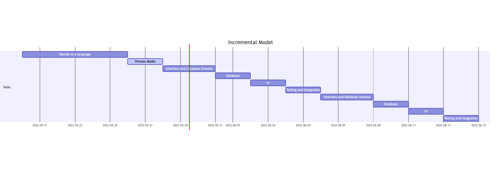

# Incremental Model

Similarly to the other two models, we start with the interface. The schedule for the incremental model resembles a sped up version of the waterfall model where the full schedule is squeezed into nine day sprints. These sprints involve just writing the bare-bones on the first pass. After a sprint or two an MVP should be ready for feedback from the owners/customers. The initial feedback is vital to directing where the focus of the next sprints should be. Depending on the project the sampling of feedback is important as well with target customers feedback being weighted the highest. For this project show the MVP to another student and ask for feedback. Direct the next sprints with it for what features are a priority. By directing the project this way you remain flexible, and ensure you're always working on what the customer/owner needs the most.

### Added after 6/2/22
# Requirements Definition
### First Version/First Sprint
- Database of users
-  Database of courses: this will contain information such as the CRN, course name, times, and instructor.
- One type of user:
  - student – can register, can see available courses and their own schedule.
- The system should include multiple semesters, print-out of schedule, scheduling preferences.
The base class of the system is user with:
- Attributes: first name, last name, ID.
- Methods: set function for each attribute, and a function to print all info for the object.
There will be one derived class:
- All derived classes must contain any additional attributes and appropriate set/get functions.
- student – the student class will have functions that allow them to search courses, add/drop courses, print their schedule.

### Second Version
- Add the two other users 
  - instructor – can see available courses and their own course roster.
  - admin – can see everything, can edit courses/users/schedules.
- The system should include multiple semesters, print-out of schedule, scheduling preferences.
- The system as a whole and all components must be tested thoroughly.
- Focus on a specific feature highlighted from feedback.