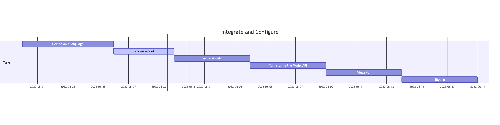

# Integrate and Configure

Through using the [Django Web Framework](https://www.djangoproject.com/) several of the steps of this project can be combined, and the timeline can be reduced. Similarly to the other two process models the interface should be the starting point. Django utilizes an ORM so both the database work and class work are combined into one step. This enables a single source of truth for the structure of the application. Django calls these structures models, and their written as Python classes. Any change to a model can be applied to the database using migrations. These migrations are stored and act as the databases version control. These models can be queried, and mutated with the Model API. Most of the UI would be written using Django's Forms which can be rendered as HTML and manipulate/display the models. Along with this Django comes with a built in admin panel to control user accounts and authentication. Most of the testing would be done with unittest, a module built into the Python standard library. Other than some date/time packages not much else would be needed for this project. 

### Added after 6/2/22
# Requirements Definition
- Database of users: the system should work for 100 students, 10 instructors, and 1 admin, however, we will test with fewer.

-  Database of courses: this will contain information such as the CRN, course name, times, and instructor.
- Three types of users:
  - student – can register, can see available courses and their own schedule.
  - instructor – can see available courses and their own course roster.
  - admin – can see everything, can edit courses/users/schedules.
- The system should include multiple semesters, print-out of schedule, scheduling preferences.
- The system as a whole and all components must be tested thoroughly.

The base class of the system is user with:
- Attributes: first name, last name, ID.
- Methods: set function for each attribute, and a function to print all info for the object.

There will be three derived classes:
- All derived classes must contain any additional attributes and appropriate set/get functions.
- student – the student class will have functions that allow them to search courses, add/drop courses, print
their schedule.
- instructor – the instructor class will have functions that allow them to print their schedule, print their class
list, and search for courses.
- admin – the admin class will have functions that allow them to add courses to the system, remove courses
from the system, add/remove users, add/remove student from a course, search and print rosters and courses.