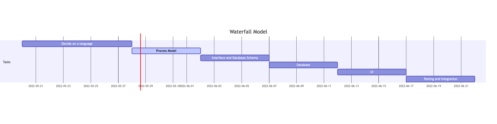

# Waterfall Model

### Interface and Database Schema Development
By defining the interface early both the frontend UI and backend database can be worked on asynchronously (if in a team larger than one.) Regardless this is a good starting place to design a system because it unveils the essential complexity of the system, and keeps the frontend and backend decoupled. Essential complexity is the stripped back complexity which exists in a real world domain, and the goal of most software projects is to represent this domain without adding unneeded complexity. Starting with an interface also helps enforce the dependency inversion principle which pushes for high and low level modules to depend on abstractions rather than each other. By helping decouple the frontend and backend the system becomes more maintainable and understandable since the scope of each module has just shrunk dramatically. In a real world project the interface stage would include speaking with domain experts and creating a model of the domain prior to starting the interface. Since the domain for this project is pretty simple the interface can also act as the domain model. Since it's unclear how much freedom is available tool wise the interfaces for this project will remain as classes. A majority of the classes were outlined in Assignment 1 with empty methods which will be filled in the database development stage. The main interface left to be designed is how dates and calendars will be handled, and stored in the database. 

### Database Development
Implement the classes/interfaces and their relationships. Put together the SQL for the main queries and commands in the sketched out methods in the classes.

### UI
Build the UI hopefully using some framework which uses components to combine styling and frontend logic into reusable components. Call the SQL queries and commands in the UI (most likely through the methods of the classes.)

### Testing
Write both component UI based tests and domain logic tests. For this project just poke around in the locally running project and check off the following:
* UI displaying properly
* Database tables match the current state of the written interfaces
* Queries and Commands reading and writing from the database properly

### Added after 6/2/22
# Requirements Definition
- Database of users: the system should work for 100 students, 10 instructors, and 1 admin, however, we will
test with fewer.

-  Database of courses: this will contain information such as the CRN, course name, times, and instructor.
- Three types of users:
  - student – can register, can see available courses and their own schedule.
  - instructor – can see available courses and their own course roster.
  - admin – can see everything, can edit courses/users/schedules.
- The system should include multiple semesters, print-out of schedule, scheduling preferences.
- The system as a whole and all components must be tested thoroughly.

The base class of the system is user with:
- Attributes: first name, last name, ID.
- Methods: set function for each attribute, and a function to print all info for the object.

There will be three derived classes:
- All derived classes must contain any additional attributes and appropriate set/get functions.
- student – the student class will have functions that allow them to search courses, add/drop courses, print
their schedule.
- instructor – the instructor class will have functions that allow them to print their schedule, print their class
list, and search for courses.
- admin – the admin class will have functions that allow them to add courses to the system, remove courses
from the system, add/remove users, add/remove student from a course, search and print rosters and courses.