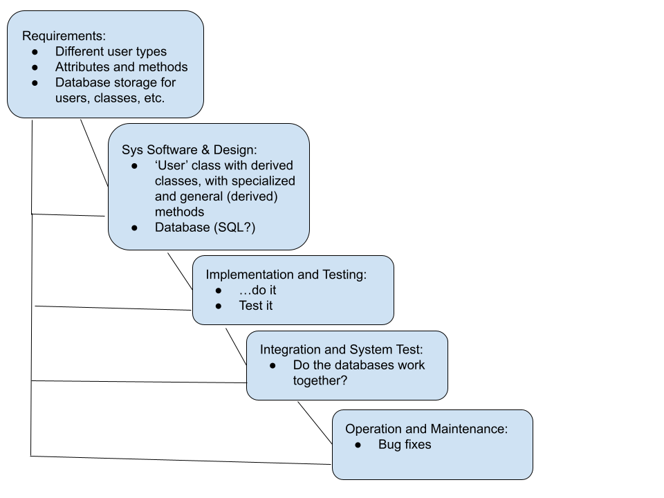
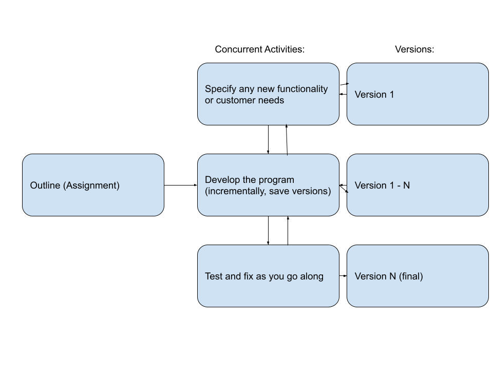
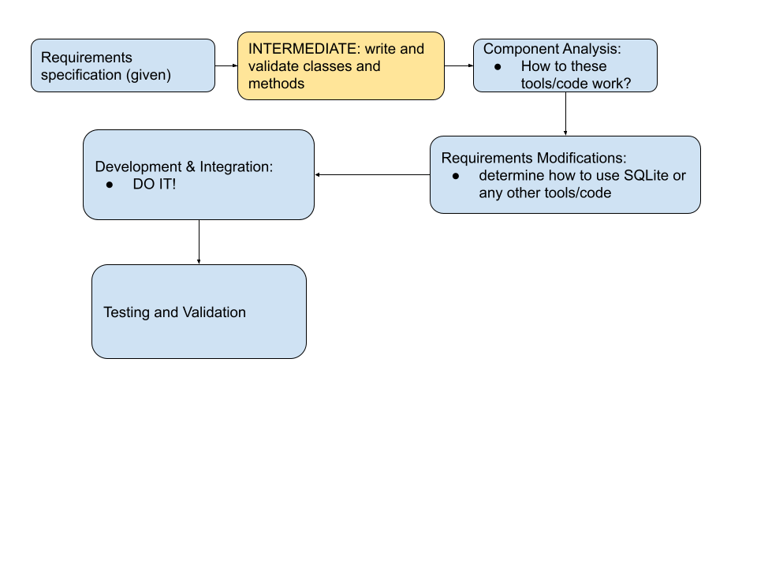

## Waterfall:

requirements - user classes, attributes, and methods, derived classes and their methods

### sys software & design 	
- user class with three derived classes, each with general (derived) and specialized methods (note: will we need a database to store all our users? I would think so.)
- database of courses each with their own attributes, multiple semesters 
### implementation and test
- write the code and test
### integrate and sys test
- implement the two databases and ensure they work when "connected"
### op & maintenance
- bug fixes

## Incremental:

Outline: mostly given in Assignment statement
concurrent activities: make student database and validate, make class database and validate, define any new functionality or customer needs
note: maintain many different versions using git branches during incremental development
<!-- Throw in how you'll maintain different version (probably git branching) -->

## Integration and Configuration:

- for our specific use case, we create the base classes and most of the functions (some functions may already be in the std py libs)
- if we want to use a GUI, we could use tkinter or pyqt
- i'm sure we could find a way to use sqlite for python to get our databases set up and working
- the rest of the code **SHOULD** be quite simple, but we could always research more to see if we can frankenstein even more code into our project
- we could use a package manager (I'm familiar with pip) for easy installation and running of the program
<!-- Something I forgot as well - discuss a package manager,  conda or pip or something -->

I think the smartest way to do INT&CONFIG is to first develop all the classes for users and their associated functions (reusing any code for simple methods). THEN move on to using tools like SQLite to get the databases working.