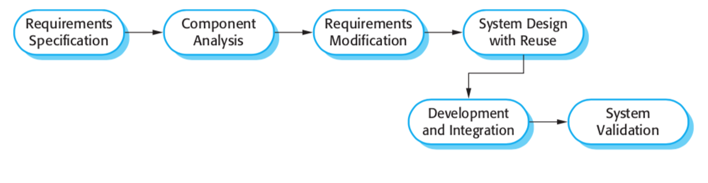

# Process Models : Resubmission
## Waterfall Model:
### Block Diagram:

### Process Breakdown:
#### Requirements definition:
In this step, the requirements and constraints of the program are outlined based on information given from the customer. In our LeopardWeb project, this is given in the header of our assignment instructions.

Goal: Design a scheduling system for a university similar to LeopardWeb. The system will
allow students, faculty, and an admin (such as the registrar) to add courses, search for courses, print schedules, etc. This system must include:
#### System and software design:
This step focuses on the architecture of the system, and it is where abstractions and relationships are defined. In this project, the user types are all inherited classes from the base "user" class, the SQL database will be connected to these classes, and a GUI/UI will allow the end-user to utilize the program. 
#### Implementation and unit testing:
This step is simple: write the code and test the components. For now, the individual components are not integrated into the greater system just yet.
#### Integration and system testing:
THIS is where the components are integrated and the system is tested. 
#### Operation and maintenance:
This step is where the "finishing touches" are made, as well as updating and fixing the program as need be.

## Incremental Model
### Block Diagram:

### Process Breakdown:
#### Outline description:
Similar to the requirements definition for the Waterfall model. Outline what the program should be.
#### Specification/Development/Validation:
These steps are all concurrent activities. They will continue happening until the project is finished.
#### Versions:
A good starting version for this project would be to create the classes, database connectivity, and a UI, which should all be very simple. Subsequent versions should INCREMENT on the initial version, creating new versions, until the final version is fully developed.  

## Integration and Configuration Model
### Block Diagram:

### Process Breakdown:
#### Requirements specification:
This step is no different than it is in the previous process models; it's the planning stage.
#### Component Analysis:
Since Integration and Configure is "reuse-oriented", the component analysis section is where existing software is researched and studied. 

An example of a component that could be used is Google's Cloud SQL hosting service, rather than setting it up to be hosted on some other machine. SQLite, which is a local, simpler version of SQL, will be used for this project instead, since it meets our needs. 

Another component that could be reused is a solution for the GUI. Code can be borrowed from a previous project or from the internet. For example, as a class we are reusing some of Prof. Carpenter's python code for tkinter.
#### Requirements Modification:
Once preexisting software components are gathered, a revision of the original requirements is done to better fit the new software.
#### System Design with Reuse:
In this step, the components are used and modified to meet the requirements.
#### Development and Integration:
Same as the other models, integrate on each new version.
#### System Validation:
Same as the other models, test.